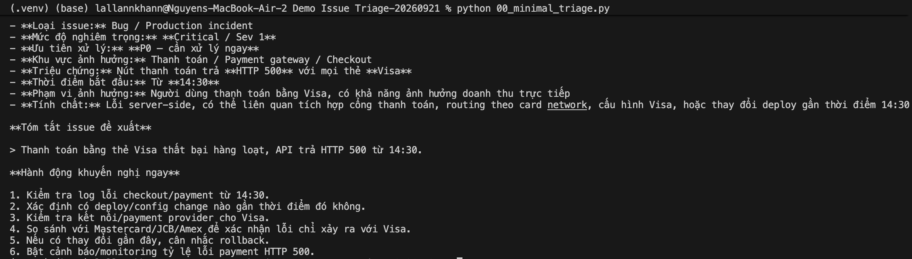
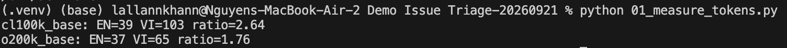
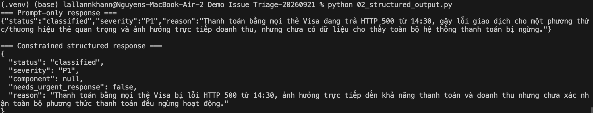
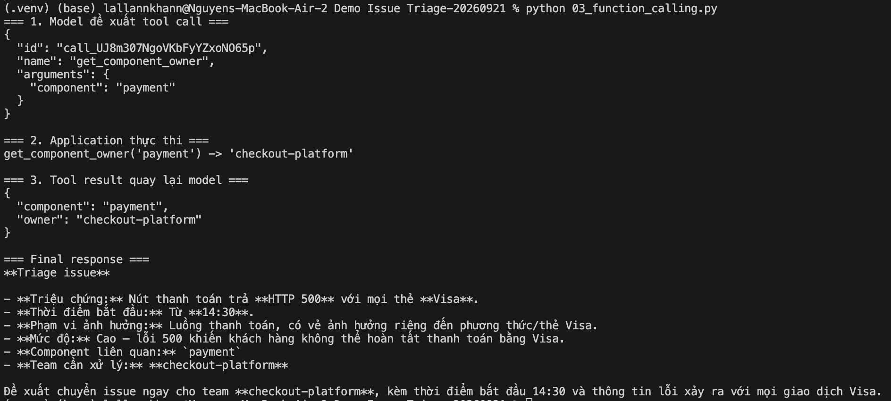
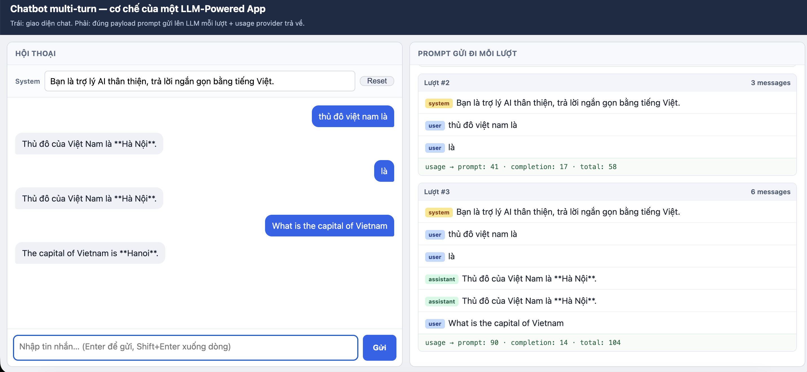

# Demo Issue Triage Mini-App

Dự án này chứa một loạt các demo hướng dẫn từng bước cách xây dựng một ứng dụng **Issue Triage (Phân loại Sự cố)** sử dụng Large Language Models (LLM). Các bài thực hành đi từ việc gọi API cơ bản nhất, cho đến Structured Output, Function Calling và cuối cùng là xây dựng giao diện hoàn chỉnh bằng Streamlit.

## Các bài Demo

### 00. Minimal Triage
Phiên bản cơ bản nhất. Ứng dụng nhận một mô tả sự cố dạng plain-text, gửi cho LLM và in ra kết quả phân loại (tự do) trên terminal.


### 01. Measure Tokens
Demo này tập trung vào việc đo lường lượng token tiêu thụ cho phần prompt và phần completion, giúp bạn ước lượng chi phí sử dụng.


### 02. Structured Output
So sánh sự khác biệt giữa việc ép LLM trả JSON bằng Prompt thông thường và việc sử dụng Structured Output (đảm bảo schema chặt chẽ) thông qua **Pydantic**.


### 03. Function Calling
Minh họa cơ chế hoạt động của Function Calling:
1. LLM đề xuất gọi tool (VD: `get_component_owner`).
2. Ứng dụng thực thi tool và lấy kết quả.
3. Ứng dụng gửi kết quả của tool về lại cho LLM để tạo ra câu trả lời cuối cùng.


### 04. Streamlit Triage UI
Giao diện Web hoàn chỉnh được xây dựng bằng **Streamlit**, bọc lại logic Function Calling ở bài 03. Giao diện giúp trực quan hoá quá trình model gọi tool, app xử lý và hiển thị thông tin trả về.

Tải và xem video demo: [04_streamlit_triage.mov](https://github.com/CryptolWhile/triage_issue/raw/main/figure/04_streamlit_triage.mov)

*(Bạn cũng có thể click trực tiếp vào file `figure/04_streamlit_triage.mov` trên Github để xem)*

### 05. Multi-turn Chatbot
Một Chatbot đa lượt (multi-turn) đơn giản nhằm minh hoạ một đặc tính quan trọng của LLM: **Stateless** (không có trí nhớ). Mỗi lần chat, ứng dụng phải gửi kèm theo toàn bộ lịch sử hội thoại trước đó.


## Hướng dẫn sử dụng

1. Clone repository này về máy.
2. Copy file `.env.example` thành `.env` và điền `OPENAI_API_KEY` cũng như `OPENAI_BASE_URL` của bạn.
3. Cài đặt các thư viện cần thiết:
   ```bash
   pip install -r requirements.txt
   ```
4. Chạy từng script bằng lệnh `python <tên_file>.py` hoặc `streamlit run 04_streamlit_triage.py`.
